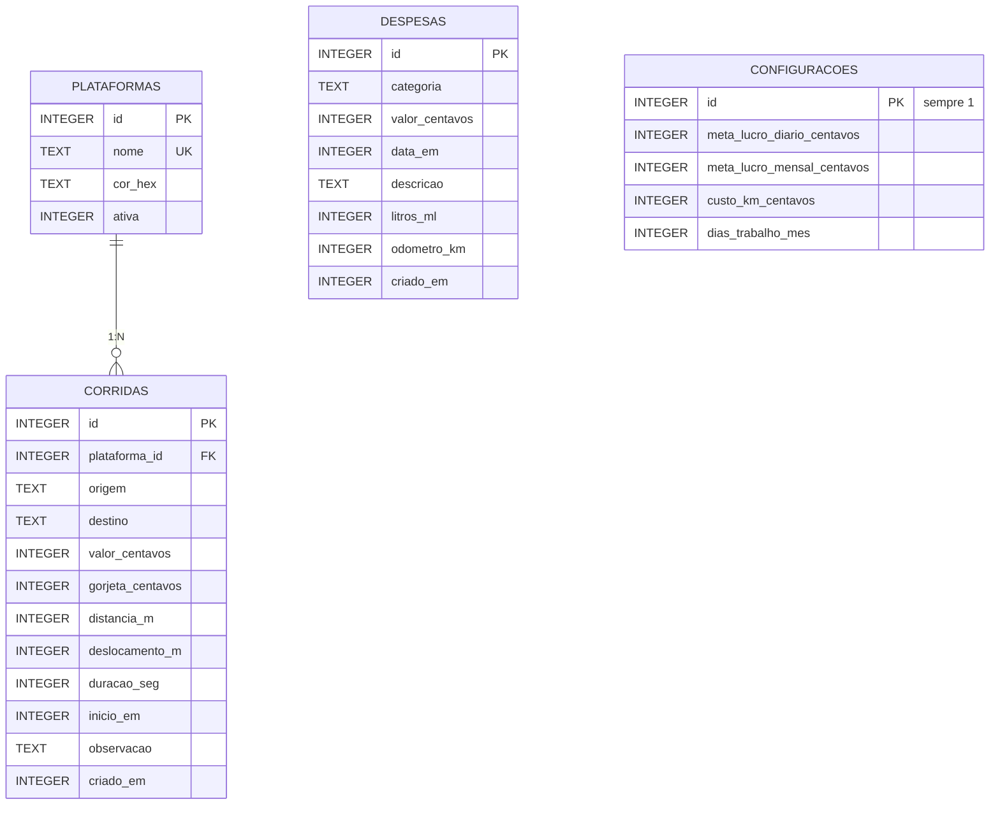

# MotoristaPro — camada de dados (Room/SQLite)

Projeto Android (Kotlin) pronto para abrir no Android Studio: **File > Open > pasta MotoristaPro**.
Dependências: Room 2.6.1 (via KSP), Jetpack Compose (BOM 2024.12.01, Material 3), lifecycle 2.8.7. Sem Hilt, sem Navigation, sem version catalog.

| Ferramenta | Versão |
|---|---|
| Gradle (wrapper) | 8.9 |
| Android Gradle Plugin | 8.7.3 |
| Kotlin / KSP / plugin Compose | 2.0.21 / 2.0.21-1.0.28 / 2.0.21 |
| JDK | 17 (o JBR que vem no Android Studio serve) |
| minSdk / compileSdk | 26 / 35 |

## Esquema relacional



DDL completo em `docs/schema.sql`.

### Decisões de modelagem
- **Dinheiro em centavos (Long)**, distância em **metros**, duração em **segundos**, datas em **epoch millis** — tudo inteiro, sem erro de ponto flutuante nas somas.
- **Plataforma é tabela** (FK com `RESTRICT`): renomear "99Pop" → "99" não quebra o histórico; desative em vez de apagar.
- **`deslocamento_m`**: km até buscar o passageiro. Não é pago, mas gasta — sem ele o custo/km real sai subestimado.
- **Categoria de despesa = enum salvo como TEXT**: adicionar categoria não exige migration.
- **`litros_ml` + `odometro_km`** (opcionais) na despesa de combustível: permitem calcular km/L real.
- **Configuração = tabela de linha única** (id = 1), para o custo/km entrar direto no SQL.
- **Índices** em `inicio_em` / `data_em`: todo relatório filtra por período.

## Métricas (em `RelatorioDao`)

| Método | Fórmula |
|---|---|
| `observarLucroDiario` | por dia local: **lucro líquido** = receita − despesas lançadas no dia; **lucro estimado** = receita − km × custo/km da configuração |
| `observarCustoPorKm` | total de despesas ÷ km total rodado (passageiro + deslocamento) |
| `observarCustoKmPorCategoria` | o mesmo, separado por categoria |
| `observarResumoPorPlataforma` | receita, km e R$/km por plataforma |
| `consumoCombustivel` | km/L pelo método tanque cheio |

Por que dois lucros: o seguro pago num único dia derruba o "lucro líquido" daquele dia (é o que saiu do bolso). O "lucro estimado" dilui os custos pelo km rodado e mostra se o dia de trabalho em si valeu a pena. Use o `observarCustoPorKm` do mês para calibrar o `custo_km_centavos` da configuração.

Todas as queries retornam `Flow`: a UI se atualiza sozinha quando uma corrida, despesa ou configuração muda.

## Uso rápido

```kotlin
val repo = (application as MotoristaApp).repository

repo.registrarCorrida(Corrida(
    plataformaId = 1, origem = "Centro", destino = "Aeroporto",
    valorCentavos = 4550, distanciaMetros = 18_300, deslocamentoMetros = 1_200,
    duracaoSegundos = 32 * 60, inicioEm = System.currentTimeMillis()
))
repo.registrarDespesa(Despesa(
    categoria = CategoriaDespesa.COMBUSTIVEL, valorCentavos = 20_000,
    dataEm = System.currentTimeMillis(), litrosMl = 34_500, odometroKm = 48_210
))

val (ini, fim) = Periodo.mes()
repo.lucroDiario(ini, fim).collect { dias -> /* lista para a tela */ }
```

## Integrar num projeto existente
1. Copie `app/src/main/java/com/motoristapro/data/` (ajuste o `package` se precisar).
2. No `build.gradle.kts` raiz, adicione o plugin KSP **com o mesmo prefixo da sua versão do Kotlin**.
3. No `app/build.gradle.kts`, copie o bloco `ksp { ... }` e as 3 linhas do Room.

## Migrations futuras
Ao alterar uma entidade: suba `version` em `AppDatabase`, crie `Migration(1, 2)` e registre em `.addMigrations(...)`. O JSON do schema de cada versão fica em `app/schemas/` (versione no git).

---

# Leitor de ofertas (AccessibilityService + janela flutuante)

```
service/
  OfertaAccessibilityService.kt  eventos da Uber/99 -> debounce -> varredura dos nós -> overlay
  OfertaParser.kt                Regex de R$, km, m, h/min + plausibilidade (Kotlin puro, testado)
  OverlayOferta.kt               janela no topo (TYPE_ACCESSIBILITY_OVERLAY), arrastável, toque fecha
  LimitesOferta.kt               mínimos de R$/km e R$/h -> BOA / MÉDIA / RUIM
res/xml/accessibility_service_config.xml
```

## Ativar no celular
1. Instale e abra o app → **Ativar leitor de ofertas** → *Apps instalados* → **MotoristaPro – Leitor de ofertas** → ligar.
2. **Android 13+ com APK instalado fora da Play Store**: o sistema bloqueia com "Configuração restrita".
   Botão **Liberar configurações restritas** → menu ⋮ → *Permitir configurações restritas* → volte ao passo 1.
3. Toque em **Testar janela flutuante** para conferir o overlay.
4. Xiaomi/Samsung/Motorola: tire o app da otimização de bateria, senão o sistema desliga o serviço.

## Sem SYSTEM_ALERT_WINDOW
O overlay usa `TYPE_ACCESSIBILITY_OVERLAY`, janela exclusiva de serviços de acessibilidade:
não pede a permissão "Sobrepor a outros apps" e fica acima dos pop-ups de oferta.

## Calibrar as Regex
Com `LOG_TEXTOS = true`, o Logcat (filtro `MotoristaPro`) mostra todo texto lido em cada oferta:
```
D/MotoristaPro: Textos: UberX | R$ 18,40 | 4 min (1,2 km) de distância | Viagem de 22 min (9,8 km)
D/MotoristaPro: Oferta: Oferta(valor=18.4, km=11.0, minutos=26)  R$/km=1.67  R$/h=42.46
```
Se a Uber/99 mudar o layout, cole a linha "Textos" num novo caso em `OfertaParserTest` e ajuste a Regex.
Pacote da 99 configurado: `com.app99.driver` — confirme no seu aparelho com
`adb shell dumpsys window | grep mCurrentFocus` e ajuste em `PACOTES_ALVO` **e** no XML.

## Play Store
Uso de Acessibilidade para ler outros apps exige: declaração no Play Console (formulário de API de Acessibilidade),
divulgação em destaque dentro do app antes de ativar e política de privacidade. Em uso próprio via APK, nada disso é necessário.

---

# Dashboard (Jetpack Compose)

```
ui/
  MainActivity.kt               setContent { MotoristaTema { DashboardRoute() } }
  Formatos.kt                   "45,90" -> centavos, litros -> ml, formatação pt-BR (testado)
  theme/Tema.kt                 Material 3 claro/escuro com verde/vermelho fixos para lucro
  dashboard/
    DashboardViewModel.kt       combina lucro de hoje + custo/km do mês + configuração num único StateFlow
    DashboardScreen.kt          Route (com estado) + Content (sem estado, com @Preview)
    Dialogos.kt                 Novo abastecimento (FAB) e Configurações
```

- **Card "Hoje"**: faturamento, despesas, lucro (verde/vermelho), barra de progresso da meta, corridas e km.
- **Ganho por hora**: receita ÷ tempo *em corrida* (soma das durações). Não inclui tempo online esperando chamada.
- **Custo por km**: real do mês corrente (despesas ÷ km). Botão "Usar valor real" grava esse número na configuração,
  que alimenta o lucro estimado e a janela flutuante do leitor de ofertas.
- **FAB "Abastecer"**: só o valor é obrigatório; litros + hodômetro opcionais habilitam o km/L real. Mostra o preço por litro ao digitar.
- **Engrenagem**: meta diária, custo/km e mínimos R$/km e R$/h do leitor de ofertas.
- A tela é reativa (Room `Flow` → `StateFlow`): salvar um abastecimento atualiza os cards na hora, e o "Hoje" vira sozinho à meia-noite.

## Gerar o APK
Android Studio: **Build > Build App Bundle(s) / APK(s) > Build APK(s)** → `app/build/outputs/apk/debug/app-debug.apk`.
Pela linha de comando: `./gradlew assembleDebug` (Windows: `gradlew.bat assembleDebug`). Testes: `./gradlew test`.

## Fluxo de permissões (MainActivity)
Ao abrir, o app mostra a tela de boas-vindas até as duas permissões estarem liberadas:
1. **Aparecer sobre outros apps** (`ACTION_MANAGE_OVERLAY_PERMISSION`, já apontando para o app);
2. **Leitor de ofertas** em Acessibilidade (com o texto de divulgação exigido pela Play Store).
Ao voltar das Configurações o estado é rechecado e o Dashboard abre sozinho.
O card "Leitor de ofertas" do Dashboard mostra se o serviço está **conectado de fato** (StateFlow `OfertaAccessibilityService.conectado`).

---

# Versão 1.1 — estilo Rydex (5 abas)

| Aba | O que tem |
|---|---|
| **Início** | Status do leitor, **Jornada** (cronômetro, km pelo GPS, gasto de combustível), lucro do dia com meta, R$/hora trabalhada, R$/km, custo/km, atalhos Abastecer / Corrida / Despesa |
| **Corridas** | Lista por Hoje / Semana / Mês / 30 dias, editar (toque) e excluir, nova corrida manual |
| **Finanças** | Resultado do mês (setas para meses anteriores), metas diária/semanal/mensal, despesas por categoria, lançamentos |
| **Relatórios** | Lucro por dia (gráfico), Uber x 99, melhores horários, custo/km por categoria, km/L real |
| **Mais** | Veículo (consumo e preço do litro → combustível/km), metas, tarifa mínima e critérios da oferta, bolha flutuante, resumo diário |

Leitor turbinado: botões **Registrar corrida** e **Ver embarque** (Street View) na janela da oferta + **bolha flutuante** com lucro do dia e tempo de turno.

Banco na **versão 3** (migração 2→3 preserva os dados): meta semanal, veículo e tabela `jornadas`.
Novas permissões: localização (GPS do turno) e notificações (turno + resumo às 22h), pedidas só quando usadas.

---

# Login e backup na nuvem (Firebase)

O app funciona **sem** Firebase: enquanto `app/google-services.json` não existir, não há tela de
login e os dados ficam só no celular. Com o arquivo no lugar, ligam o login (email/senha e Google)
e o backup automático em `usuarios/{uid}` no Firestore.

Passo a passo completo: **`docs/firebase.md`**.

### Teste grátis e assinatura

14 dias de teste a partir do primeiro login; depois, R$ 14,90/mês ou R$ 39,90/trimestre.
Como o app é instalado por APK (e não pela Play Store), a cobrança do Google não se
aplica: o pagamento é feito no Mercado Pago e liberado por uma função do Firebase.

O código do servidor fica em `servidor/` (funções + regras do Firestore) e o passo a
passo para ligar tudo está em **`docs/assinatura.md`**.

```
auth/
  AutenticacaoManager.kt   email/senha, Google (Credential Manager), mensagens de erro em português
  LoginScreen.kt           entrar / criar conta / esqueci a senha / entrar com o Google
  Tarefas.kt               espera Task do Firebase dentro de coroutine (sem biblioteca extra)
nuvem/
  SincronizacaoNuvem.kt    envia/baixa o backup (JSON compactado em gzip) no Firestore
  DadosJson.kt             converte as tabelas para JSON e de volta (org.json, sem dependência)
data/local/dao/SincronizacaoDao.kt   exporta e importa tudo numa transação só
```

**Atenção:** o `applicationIdSuffix = ".debug"` foi removido — o pacote agora é sempre
`com.motoristapro`. Faça **backup** antes de instalar esta versão e **restaure** depois
(veja o aviso no início de `docs/firebase.md`).

---

# Perfil, ícone e atualização automática (1.7.0)

- **Meu perfil** (topo da aba Mais): nome, telefone, cidade e a conta usada para entrar.
  Vai junto para a nuvem. Banco na **versão 6** (migração 5→6 adiciona as três colunas).
- **Ícone**: volante verde-limão desenhado em vetor (`res/drawable/ic_launcher_foreground.xml`
  + `res/mipmap-anydpi-v26/ic_launcher.xml`). Sem PNG: minSdk 26 já usa ícone adaptativo.
- **Atualização sem Android Studio**: `atualizacao/AtualizacaoManager.kt` lê `app/versao`
  no Firestore, baixa o APK e abre o instalador. Passo a passo em **`docs/atualizacao.md`**.
